```{r setup, include=FALSE}
knitr::opts_chunk$set(echo = TRUE, error = TRUE, fig.align = "center")
```

# Learning Objectives<br>

* Know some common sources of errors
* Know some techniques and approaches of how to solve the errors

**Duration - 1 hour**

<br>

There are a lot of debugging tools in R which are great for digging into errors often found within functions you have written (will be covered in the ‘Functions’ lesson). However, for the duration of this course you will mainly face errors which do not require these tools and just need some old fashioned problem solving. 

Below are some common issues and some helpful tips. Some of these may sound obvious but when you’ve been staring at the same problem for a while normal reasoning can sometimes go out the window! 

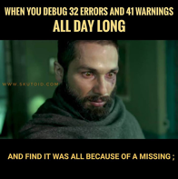{width=30%} 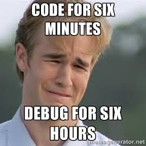{width=30%} 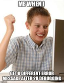{width=30%}


# Common issues

## Common issue 1

<blockquote class='task'>

**Task - 1 minute**

What is the issue here:

```{r}
the_name_of_my_variable <- c(3, 4, 5)

the_name_of_my_varaible == 4
```

<details>
<summary> **Solution** </summary>

There is a spelling mistake when calling the variable, the_name_of_my_var**ai**ble and not the_name_of_my_var**ia**ble. Should be:

```{r}
the_name_of_my_variable <- c(3, 4, 5)

the_name_of_my_variable == 4
```

Spelling! Often this will result in R thinking that the object you have created is not there ... but it's actually because you have misspelled it either when you assigned it or when you have tried to call it. 

</details>

</blockquote>


**Check/Tip**

* This is a motivation to keep variable names simple, and not too long. You can use ls() to give you a list of all the current objects in R, which may help you spot a spelling error. However, sometimes an error like this may take someone else taking a look at your code to spot the mistake!

* You can often hit tab to autocomplete variable names to ensure they're spelled the same way as when you assigned them.

* If you change the variable name where you assign it, remember to change it to match the new name in every place that variable is used in the code.

* R Studio version 1.3 will have real time spell checking, more info [here](https://blog.rstudio.com/2020/02/11/rstudio-1-3-preview-real-time-spellchecking/)

* There is a greatly named packaged named `fcuk`, where once loaded each time a typo occurs, a correction suggestion will be made under the default error message. More info [here](https://cran.r-project.org/web/packages/fcuk/vignettes/fcuk.html) 

## Upstream change 

Another common error is if you have changed something in your code further up in your script but haven’t re-run all bits that are dependent on this change so it’s not filtering through to your current code chuck.

**Check/Tip**

Remember to run all the code after a change (by selecting ‘Run All Chunks Below’ when cursor is in the amended chunk or, if it doesn't take too long, rerun full script). 

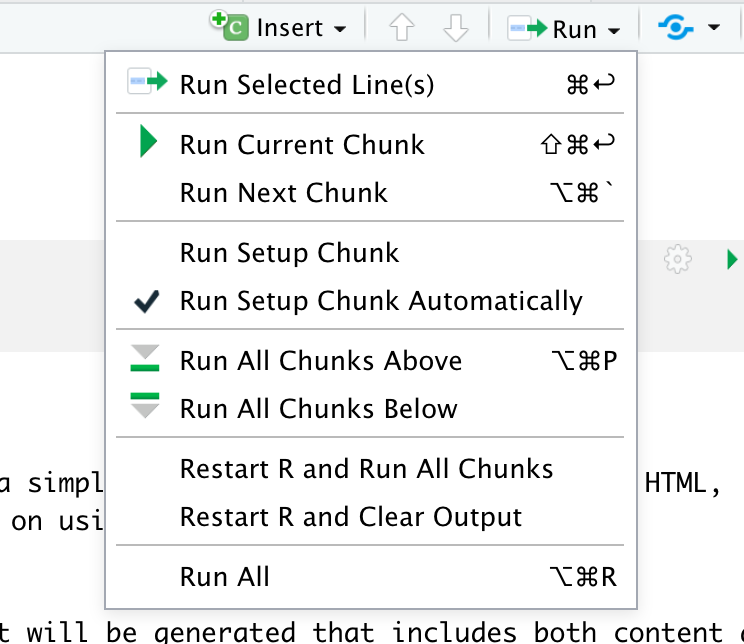{width=30%}


## Common issue 2


<blockquote class='task'>

**Task - 1 minute**

What is the issue here:

```{r}

the_name_of_my_variable <- c(3, 4, 5)

filter(the_name_of_my_variable, variable == 4)

```

<details>
<summary> **Solution** </summary>

Filter only works on data frames and this is a vector. 

Sometimes environment objects are not as expected, either in data type or by dimension. Often functions and operations are dependent on the size and type of an object and so applying an operation to something of the wrong data type or wrong dimension can cause errors.

</details>

</blockquote>


**Check/Tip**

Check the objects used in the line of code causing the error are the type and dimensions you expect (may have to step back through code to check this). You can highlight the objects individually and use a short-cut (`cmd + enter` on Mac, `ctrl + enter` on Windows) to just run the selected code. You can also check in the Environment tab (top right of R Studio):

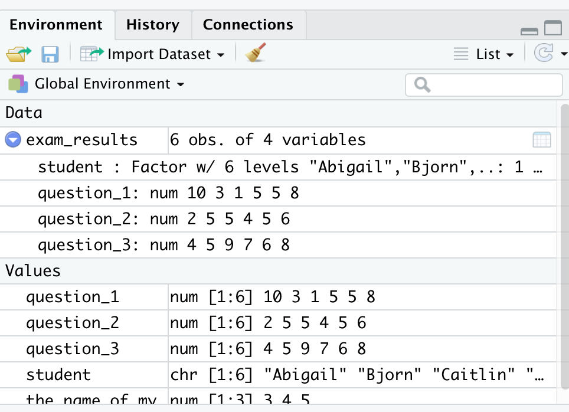{width=30%}

Or do checks such as dim(), length() and class():

```{r}
dim(the_name_of_my_variable)
length(the_name_of_my_variable)
class(the_name_of_my_variable)
```


## Conflict of functions
Conflicts due to the different functions with the same name in different packages was introduced as part of the 'Functions' lesson. These conflicts may cause errors if you try to use a function that is named the same in two packages you have loaded, and unfortunately the error messages are not very obvious. For example, let's load the following packages dplyr and MASS.

```{r}
library(dplyr)
library(MASS)
```

Can see here once load 'MASS' you get a message saying *'The following object is masked from ‘package:dplyr’:select'*. This means there is a function named 'select' in both MASS and dplyr and because you have loaded MASS **after** dplyr then the select function in MASS will be used unless stated explicitly (via dplyr::select). 

If you now try to use the select function as expect it to be the functionality from the dplyr package (the select function is expected to select a column in a dataframe) then you will get the following message:

```{r}
select(mtcars, mpg)
```

This message isn't clear that the issue is due to R trying to use the MASS::select when user is trying to use dplyr::select. 


**Check/Tip**

You may only experience a few conflicts during this course, but as you start experimenting with more packages from CRAN but especially from GitHub, you may find many different conflicts arising.

You can list conflicts vis the conflicts() function, which will list any functions where has conflicts (but some of them are intentional e.g. for dplyr provides its own versions of several functions from base R, such as filter and lag, which will see when load dplyr). 

```{r}
conflicts()
```

These is also a package called 'conflicted' which you can load at the start of a script. It makes every conflict an error and forcing you to explicitly choose which function to use. 

<blockquote class='task'>

**Task - 2 minute**

Let's retry the example above but trying `dplyr::select()` to specify which package we want to use. 


<details>
<summary> **Solution** </summary>
```{r}
library(dplyr)
library(MASS)

dplyr::select(mtcars, mpg)
```
</details>
</blockquote>

One of the most common conflicts is `MASS::select` vs. `dplyr::select` and so when getting an error using select, try to remember this lesson :) Another common culprit is `filter`.


## Common issue 3 

<blockquote class='task'>

**Task - 1 minute**

What's the issue here:

```{r}
the_name_of_my_variable <- c(3, 4, 5)
the_name_of_your_variable <- c(6, 7, 8)

both_variables <- tibble(the_name_of_my_variable the_name_of_your_variable)
```

<details>
<summary> **Solution** </summary>

There is a comma missing from between the vectors being listed in the dataframe. It should read

```{r}
the_name_of_my_variable <- c(3, 4, 5)
the_name_of_your_variable <- c(6, 7, 8)

both_variables <- tibble(the_name_of_my_variable, the_name_of_your_variable)

both_variables
```

Often if a comma is missing in a function (when listing arguments) then you will get the above error.

</details>

</blockquote>

## Common issues 4

<blockquote class='task'>
**Task - 1 minute**

What's the issue here:

```{r}
some_characters <- c("Steph", "Del", "Mhairi, "Aileen")
```

<details>
<summary> **Solution** </summary>

There is a quotation mark missing after Mhairi's name. It should read

```{r}
some_characters <- c("Steph", "Del", "Mhairi", "Aileen")

some_characters
```

These errors can be a little confusing at first because it reads *'unexpected symbol'* so may think there is an additional symbol in there, rather that one is missing. But it generally means that it's not got the symbols it was expecting in the order it was expecting. 

</details>

</blockquote>


## Common issue 5

<blockquote class='task'>
**Task - 1 minute**

What's the issue here:
```{r}
both_variables <- tibble(the_name_of_my_variable, the_name_of_your_variable,)
```


<details>
<summary> **Solution** </summary>

There is an extra comma at the end of the creation of the dataframe that has no object. It should read:

```{r}
both_variables <- tibble(the_name_of_my_variable, the_name_of_your_variable)

both_variables
```

You can conversely have the situation where you have extra syntax, again often quotation marks, commas and brackets, and will see the error above. 

</details>

</blockquote>

**Check/Tip**

If you have forgotten a bracket or quotation mark at the end of a line then in the console there will be a "+" rather then “>”  which means looking for the code line to be completed. Click into the console, press ESC, add the “)" to the script, and try again.

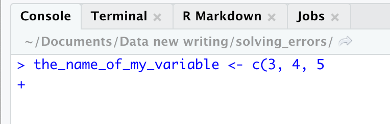{width=30%}

Additionally if you click next to a bracket then the corresponding opening/closing bracket will highlight which is useful in determining if you may have missed a bracket (this will come in handy later for R Shiny in particular!).

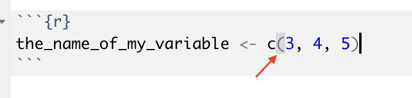{width=30%}

## Loading packages 
Loading a package that you’ve either not installed (so need to install) or have *just* installed. It may read something like this (if you install and load the package straight away):


```{r, eval=FALSE}
install.packages("zoo")
library(zoo)

#Error in library(zoo) : there is no package called ‘zoo’
```

**Check/Tip**

Sometimes when you first install a package you need to re-start your R session before about to load it. Shortcut is `ctrl + shift + F10`. 

# Other helpful tips 

## Building code up 
If running a whole R notebook chunk can simplify by **running code line by line**, building up to source line of error. Can highlight line and command+enter to run a single line. Similarly can **comment out particular lines of code** (using `#`) and progressively uncomment lines.  

## Read the error message
Error message are not always intuitive but most of the time can at least point you in the direction of where error is occurring.


## Google the error message
The likelihood is that someone has faced this error before, so cannot stress the usefulness of the website StackOverflow enough! It is the go-to website for programmers to share their (programming!) problems and help with finding solutions. It may sound silly but finding useful answers and explanations on StackOverflow is an art and skill in itself, which will get easier with practice. 

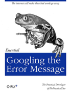{width=30%} 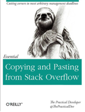{width=30%}

<blockquote class='task'>

**Task - 2 minute**

Using the example error from earlier try giving the error message you get a Google (and specifically keep an eye out for Stack Overflow pages). 

```{r}
the_name_of_my_variable <- c(3, 4, 5)
the_name_of_your_variable <- c(6, 7, 8)

both_variables <- tibble(the_name_of_my_variable the_name_of_your_variable)
```


</blockquote>

The caveat of this is **don’t blindly copy and paste a bit of code** seen on StackOverflow. You want to understand how it is working because even though it may work it is so so important to know why, which will help you for the next (inevitable) time you face something similar. Additionally you should be able to explain and understand all your code, it will not be sufficient at work to say ‘I just copied this from the internet’.

*Errorist* is a package in R which allows the user to automatically search errors and warnings straight from R console https://github.com/r-assist/errorist.

<blockquote class='task'>

**Task - 2 minute**

Using the sample example as above try first loading the errorist library and see how it works

```{r}
library(errorist)

the_name_of_my_variable <- c(3, 4, 5)
the_name_of_your_variable <- c(6, 7, 8)

both_variables <- data.frame(the_name_of_my_variable the_name_of_your_variable)

```
</blockquote>


This might be a bit overkill (especially if like to problem solve before googling!) but it's interesting to learn about the kind of tools and packages people are building to cater to common problems users of R face. 

## Step away from your computer

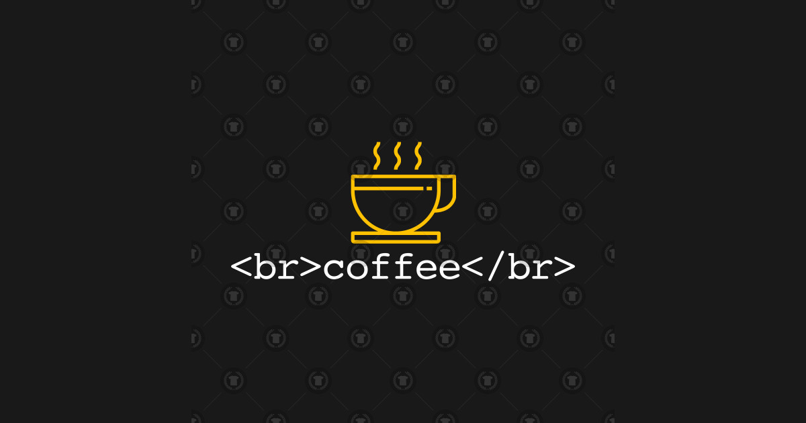{width=40%}

Sometimes you’ve been staring at an issue for so long you can no longer see sense. Take a break, get a drink or a breather. Come back with fresh eyes and the answer may come to you! 
Sometimes it is hard to check errors running on large datasets because testing out adjustments to the code are slow to run and it's also difficult to pinpoint the issue to due complexity of the data. Try sampling the dataset so it runs on a smaller volume or create a small test dataset which you can run the code on and it will make it easier to detect the source.

## Rubber duck debugging

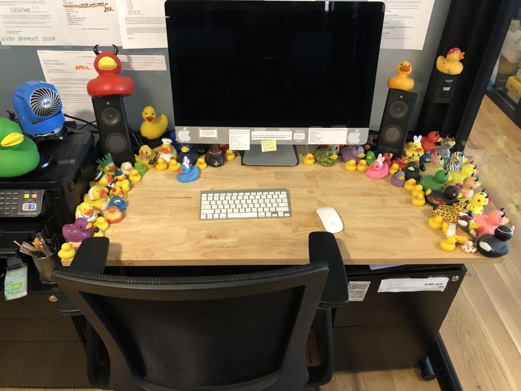{width=40%}

This is a term used in software engineering as a method of debugging code (and why you see so many rubber ducks around CodeClan!). The concept is that you explain what your code is doing line by line and at a level the duck (i.e. something that someone who knows nothing about programming will understand). By doing this you may well come across the error when thinking out loud what your code is doing. 

More info: https://www.thoughtfulcode.com/rubber-duck-debugging-psychology/


## Get someone to check over your code

{width=40%}

Get someone to check over your code - whether that be a peer or an instructor. This is invaluable, and don’t worry about hassling others for help. Reviewing other people’s code is a **great tool for learning too**, you can see how others approach problems and can learn about new ways of doing things. When working as an analyst you will often have to review other’s code and it’s great practice to start now! 

It also gives you **practice in walking the reviewer through your code** (similar logic as rubber duck debugging). Don’t forget you might have been working on a project/code script for some time and take for granted your knowledge and understanding of it when explaining to someone else to review who doesn’t know what your working on or your logic to approaching the problem. Take a step back and ensure you are explaining it throughout to allow the reviewer to understand and help. Again, this will be something you will do regularly as an analyst and is good to practice! 

## Warnings (not just errors) 
As mentioned in the 'Packages' lesson there are warnings and there are errors - this not only applies to loading packages but writing code in general. You will be forced to read an error message as your code won’t run, but make sure you read warning messages too! Even though the code has run, warnings can indicate it's not running as expected or something may crop up down the line, which is why it's warning you!

Vector recycling is an example of a warning message where the code is likely not running as expected (unless specifically looking for this kind of matching) but it will run it with the following error:

<blockquote class='task'>

**Task - 2 minute**

What is the issue here:

```{r}
the_name_of_my_variable <- c(1, 2, 3, 4, 5, 6, 7, 8, 9, 10)
subset_variable <- c(2, 3, 4)


the_name_of_my_variable == subset_variable
```

<details>
<summary> **Solution** </summary>

This is doing 'vector recycling', which is likely not what you want (although it may be!). It's more likely the command should be:

```{r}
the_name_of_my_variable %in% subset_variable
```

where the position of the elements in the subset_variable does not matter. 

</details>

</blockquote>

So it's important to read warnings, not just errors!

## Exception is class code alongs
When we are doing code alongs in class you may not have time to go through all these so then it's better to get the attention of an instructor that can fix your error quickly so you are able to keep up. However, during homeworks, labs and projects you may find it useful coming back to this lesson and going through these tips again.


# Additional resources 
Conflicts: https://developer.r-project.org/Blog/public/2019/03/19/managing-search-path-conflicts/
